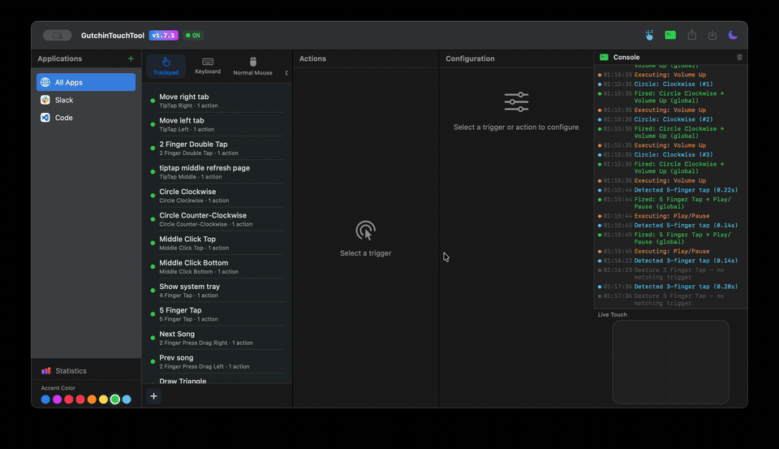

I didn't write nor did I read a single line of what Claude did here.

Have fun.

## Demo

## Building

1. Clone the repo
2. Open `GutchinTouchTool.xcodeproj` in Xcode
3. Build and run (Cmd+R)

The app requires:
- **macOS 13+**
- **Accessibility permissions** — the app will prompt on first launch. Grant access in System Settings > Privacy & Security > Accessibility
- **Automation permissions** — needed for AppleScript-based actions (System Events)

The app uses the private `MultitouchSupport.framework` for raw trackpad touch data. No external dependencies.
